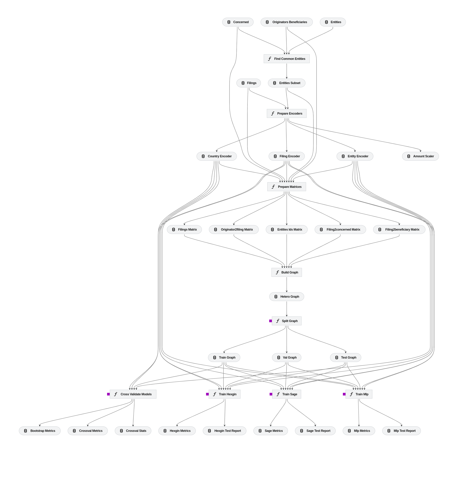

# HexGIN: An Analysis of Novel Money Laundering Data Using Heterogeneous Graph Isomorphism Networks

## Publication Reference

**Wójcik, F. (2024). An Analysis of Novel Money Laundering Data Using Heterogeneous Graph Isomorphism Networks. FinCEN Files Case Study. Econometrics. Ekonometria. Advances in Applied Data Analysis, 28(2), 32-49.**

## Project Overview
This project accompanies the above-mentioned publication and focuses on developing and applying the novel HexGIN (Heterogeneous extension for Graph Isomorphism Network) model to the FinCEN Files case data. The primary goal is to compare HexGIN's performance with existing solutions such as the SAGE-based graph neural network and Multi-Layer Perceptron (MLP), demonstrating its potential advantages in anti-money laundering (AML) systems.

The dataset in `data/01_raw` folder contains the original files made publicly available by the International Consortium of Investigative Journalists (ICIJ) as part of the FinCEN Files investigation. It can be found under the following address, with the full case description: [original data source](https://www.icij.org/investigations/fincen-files/download-fincen-files-transaction-data/).


## Processing Pipeline

The data processing pipeline consists of several stages:

### Data Preprocessing Pipeline
1. **Data Collection and Cleaning**:
    - Load raw transaction data from the FinCEN Files.
    - Clean the data to handle missing values, remove duplicates, and correct inconsistencies.
2. **Feature Engineering**:
    - Transform transaction data into a graph structure.
    - Extract relevant features such as node attributes and edge attributes.
3. **Graph Construction**:
    - Construct a heterogeneous graph representing various entities (e.g., individuals, accounts) and their relationships (e.g., transactions).

### Experiment Preparation Pipeline
1. **Data Splitting**:
    - Split the graph data into training, validation, and test sets ensuring no data leakage between sets.
2. **Normalization and Scaling**:
    - Apply normalization and scaling techniques to ensure the data is suitable for model training.
3. **Preparation of Training Data**:
    - Format the data into a suitable structure for input into the different models (HexGIN, Graph SAGE, MLP).

### Experiment Pipeline
1. **Model Training**:
    - Train the HexGIN model on the training data.
    - Also train baseline models (Graph SAGE and MLP) for comparison.
2. **Model Evaluation**:
    - Evaluate the models using cross-validation on the training set.
    - Use metrics such as F1 score, precision, and ROC AUC for performance comparison.
3. **Testing**:
    - Apply the trained models to the test set and compare their performance.

Picture below presents detailed overview of the processing pipeline and dependencies between steps.



## Model Types
- **HexGIN**: A novel extension of Graph Isomorphism Networks capable of handling heterogeneous data.
- **Graph SAGE**: A well-established graph neural network model used for inductive node embedding.
- **MLP (Multi-Layer Perceptron)**: A traditional neural network model that operates on flattened tabular data.

## Setup and Installation

### Dependencies
The main dependency resolution tool used in this project is **poetry**. The environment management is handled using **conda**.

### Installation Steps
1. **Clone the repository**:
    ```bash
    git clone <repository-url>
    cd <repository-directory>
    ```

2. **Create a Conda environment**:
    ```bash
    conda env create -f environment.yml
    conda activate hexgin
    ```

3. **Install dependencies using Poetry**:
    ```bash
    pip install poetry
    poetry install
    ```

4. **Run the experiments**:
    ```bash
    kedro run
    ```

For your convenience, steps 1-3 can be autometed by running the following command:
```bash
sh ./setup_project.sh
```

You will need to activate the environment later via

```bash
conda activate hexgin
```


### Notebooks

- **Compare Results**: The `compare_results.ipynb` notebook provides a detailed comparison of the models' performance, presenting differences between HexGIN, Graph SAGE, and MLP.

- **Models presentation**: The `models_presentation.ipynb` notebook provides a detailed overview of the HexGIN model, Graph SAGE, and MLP, including their architecture and training process. 

## Running the Project
To run the entire pipeline, use the following command:
```bash
kedro run
```

To visualize the pipeline, use:
```bash
kedro viz
```
